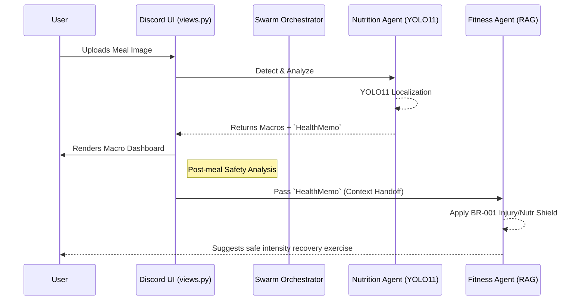

# 🛡️ Personal Health Butler AI v8.5 (Stage Ready Edition)

<div align="center">
  
  
  
  
</div>

> Your intelligent, proactive, and privacy-first digital health companion. Developed for Capstone 2026.

---

## 🌟 The v8.5 Architecture (Decoupled & Agentic)

Personal Health Butler v8.5 introduces a **Modular Decoupled Architecture**, transitioning from a monolithic Bot object to a specialized multi-agent swarm.

| Component | Core Technologies | Key Capabilities |
| :--- | :--- | :--- |
| **👁️ Perception** | **YOLO11 + Gemini 2.5 Flash** | Real-time food localization + semantic analysis. Latency < 5s. |
| **🧠 Intelligence** | **Agentic Swarm Protocol** | Nutrition, Fitness, and Engagement coordination with context handoffs. |
| **🛡️ Safety** | **BR-001 Safety Shield** | Dynamic RAG-based exercise filtering. Blocks intense workouts post-heavy-meals. |
| **🔒 Privacy** | **Sensitive Intent Rerouting** | Automated PII protection. Redirects trends/summaries from public channels to DMs. |
| **💾 Persistence** | **Supabase + RLS** | Secure, per-user health history, metabolic profiling, and achievement tracking. |

---

## 🛠️ User Commands & Interactions

The bot supports Slash commands (`/`), Natural Language triggers, and Interactive UI Views.

### 🎮 Command Registry

| Command | Category | Description |
| :--- | :--- | :--- |
| `/setup` | Onboarding | Initialize or update your health metrics (Height, Weight, Goals). |
| `/demo` | Quick Start | Activate demo mode with a pre-configured health persona. |
| `/help` | Guidance | **[NEW]** Tiered help system (Onboarding, Logging, Privacy, Support). |
| `/roulette` | Gamification | **[NEW]** Spin the 🎰 Food Roulette for budget-aware meal ideas. |
| `/trends` | Analytics | Generate a 30-day visual health report (Auto-rerouted to DM). |
| `/summary` | Analytics | Real-time daily macro/calorie report (Auto-rerouted to DM). |
| `/settings` | Preferences | Toggle proactive morning check-ins and notification intensity. |
| `/reset` | Danger Zone | Wipe your persistent profile and history. |

### 🧠 Intent-Based Triggers
- **Greeting**: "hi", "hello" → Triggers premium onboarding flow.
- **Profiling**: "Who am I?", "my profile" → Displays current health metrics.
- **Support**: "I need help", "help" → Triggers the segmented help embed.

---

## 🏗️ Multi-Agent Coordination Flow



---

## 📂 Documentation & Engineering Logs

- **[Milestone 2 Report](docs/management/milestones/milestone2/milestone%202%20report.md)**: Evolution from v1.0 to v2.0.
- **[System Upgrade Log](system_upgrade.md)**: Detailed module-by-module engineering entries.
- **[Midterm Demo Plan](docs/management/milestones/milestone2/midterm_demo_plan.md)**: Presentation script and technical defense strategy.

---

## 🚀 Quick Start (Production Setup)

1. **Clone & Install**:
   ```bash
   git clone https://github.com/kevinhust/capstonetest.git
   pip install -r requirements.txt
   ```
2. **Configure environment variables** in `.env` (Consult `.env.template`).
3. **Launch the swarm**:
   ```bash
   PYTHONPATH=. python3 -m src.discord_bot.bot
   ```

---
*Generated by Antigravity - Version 8.5 | Architectural Excellence*
