# 🛡️ Personal Health Butler AI v6.1 (Flagship Edition)

<div align="center">
  
  
  
  
</div>

> Your intelligent, proactive, and science-backed digital health companion.

---

## 🌟 The V6.1 Architecture (5-Layer Paradigm)

Personal Health Butler v6.1 introduces a groundbreaking 5-layer architecture designed for sub-5-second latency and proactive health management.

| Layer | Core Technologies | Key Capabilities |
| :--- | :--- | :--- |
| **👁️ Perception** | **YOLO11 + Gemini 2.5 Flash** | Extreme precision visual recognition (food macros, portion size estimation). Latency < 5s. |
| **🧠 Central Hub** | **Swarm Handoff Protocol** | Multi-agent coordination. Seamless context passing between Nutrition & Fitness Agents. |
| **🛡️ Safety** | **RAG Injection & BR-001** | Dynamic medical disclaimers. Real-time interception of unsafe exercises based on recent meals. |
| **🎮 Interaction** | **Discord Bot / UI Views** | Food Roulette 🎰, Proactive Push Reminders, Dynamic `[🏃 Work it off!]` Action Buttons. |
| **💾 Persistence** | **Supabase v6.0 Serverless** | Automated TDEE triggers (`calculate_tdee`), monthly trend indexing (`v_monthly_trends`), and Gamification (`achievements`). |

---

## 🔄 Core Workflows

### 1. Calorie Balance Shield (Active Defense)
A real-time feedback loop between diet and exercise.

```mermaid
sequenceDiagram
    participant User
    participant Bot as Discord UI
    participant Nutrition as Nutrition Agent (Swarm)
    participant Fitness as Fitness Agent (Swarm)
    
    User->>Bot: Uploads image of Fried Chicken (High Calorie)
    Bot->>Nutrition: execute_async(image_path)
    Nutrition-->>Nutrition: YOLO11 + Gemini Analysis
    Nutrition-->>Bot: Returns Macros + `suggest_fitness_transfer=True`
    Bot->>Bot: Detects risk, mounts `[🏃 Work it off!]` button
    Bot-->>User: Displays Meal Embed + Warning + Button
    User->>Bot: Clicks `[🏃 Work it off!]`
    Bot->>Fitness: execute_async(handoff_signal + context)
    Fitness-->>Fitness: Analyzes context (Heavy meal + Profile)
    Fitness-->>Fitness: RAG Injects BR-001 Safety Filter
    Fitness-->>User: Returns safe, low-intensity recovery workout
```



### 2. Food Roulette 🎰 (Gamification)
Instead of rigidly tracking calories, users can spin the "Food Roulette" to discover budget-aware meal recommendations.

- **Dynamic Filtering:** Filters potential meals based on user allergies (e.g., Tree Nut) and remaining daily Calorie Budget.
- **Micro-animations:** Built into the Discord Interaction pipeline utilizing ephemeral spinning message states.

---

## �️ User Commands

The bot supports both Slash commands and Natural Language triggers.

| Command | Description |
| :--- | :--- |
| `/setup` | Initialize or update your health profile (Step-by-step). |
| `/demo` | Activate Demo Mode for quick testing/onboarding. |
| `/exit` | Exit Demo Mode and clear temporary session data. |
| `/reset` | **⚠️ Danger Zone:** Permanently clear your profile and history. |
| `/settings` | Toggle morning check-ins and proactive notifications. |
| `/trends` | Generate a 30-day health analytics report with AI insights. |
| `/roulette` | Spin the 🎰 Food Roulette for budget-aware meal ideas. |
| `Who am I?` | (Natural Language) Display your currently active health profile. |
| `Summary` | (Natural Language) Get your real-time nutrition & activity report. |
| `Help` | (Natural Language) List all available features and tips. |

---

## �🚀 Quick Start

### 1. Dependencies
This prototype uses `pip` and `.env` configured environment variables.
```bash
python3 -m venv venv
source venv/bin/activate
pip install -r requirements.txt
```

### 2. Environment Variables (`.env`)
Make sure to copy the `.env.template` and populate:
- `DISCORD_TOKEN`: Your Discord Bot Token.
- `GOOGLE_API_KEY`: API Key for Gemini 2.5 Flash.
- `SUPABASE_URL` & `SUPABASE_SERVICE_ROLE_KEY`: Persistence connection strings.

### 3. Launch the Bot
```bash
PYTHONPATH=. python3 -m src.discord_bot.bot
```

---

## 📂 Repository Structure

```text
├── src/
│   ├── agents/          # Autonomous agents (Nutrition, Fitness, Router)
│   ├── discord_bot/     # Discord UI, Views, and Application Transport
│   ├── data_rag/        # RAG context and guidelines for Agents
│   ├── swarm.py         # Multi-Agent Coordination Protocol
│   └── supabase/        # Database clients / connection singletons
├── data/                # Local Persistence / Reference JSONs
├── scripts/             # Deployment and Testing utilities
└── tests/               # E2E Simulations and Unit Tests
```
