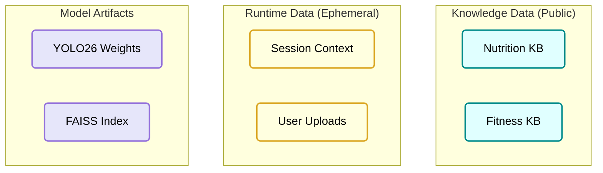

# L3 Data Architecture
# Personal Health Butler AI

> **Version**: 1.1
> **Last Updated**: 2026-01-16
> **Parent Document**: [PRD v1.1](./PRD-Personal-Health-Butler.md)
> **TOGAF Layer**: L3 - Data Architecture

---

## 1. Data Architecture Overview

### 1.1 Data Domains (Simplified)



### 1.2 Data Flow & Privacy

- **Ingestion**: Public data (USDA) -> Chunking -> Vector Store.
- **Runtime**: User Image -> RAM -> Inference -> **Delete**.
- **Privacy Guarantee**: No user images are ever written to disk. No database persists user conversations.

---

## 2. Knowledge Base Schema

### 2.1 Chunk Structure (Optimized for RAG)

```python
@dataclass
class KnowledgeChunk:
    """Standardized Knowledge Unit"""
    id: str
    content: str          # Text content (e.g., "Bananas contain 89 calories per 100g...")
    source: str           # "USDA", "OpenFoodFacts"
    source_url: str       # Verifiable link
    embedding: List[float] # 1024-dim (e5-large-v2)
    metadata: Dict[str, Any] # {"food_group": "fruit", "verified": true}
```

### 2.2 Vector Store (FAISS)

- **Index Type**: `IndexFlatIP` (Inner Product for Cosine Similarity) for high recall.
- **Dimension**: 1024 (matching `intfloat/e5-large-v2`).
- **Storage**: disk-based `index.faiss` file (read-only at runtime).

---

## 3. Data Sources & Governance

### 3.1 Primary Data Sources

| Domain | Source | License | Integration Method | 2026 Compliance Note |
|--------|--------|---------|--------------------|----------------------|
| **Nutrition** | **USDA FoodData Central** | Public Domain | JSON API / Bulk CSV | Government source, high trust |
| **Nutrition** | **Open Food Facts** | ODbL (Open) | Data Dump | community-verified data |
| **Fitness** | **ExRx / Public Guidelines** | Check Terms | Manual Curation | Citation required for reliability |

### 3.2 Privacy & Ethics

- **Differential Privacy**: Not strictly applicable to *public* knowledge, but applied if aggregating any user stats (future).
- **Synthetic Data**: For training YOLO26, we will prioritize **synthetic food datasets** (generated via Diffusion models) to augment Food-101, avoiding potential privacy/copyright issues with scraped web images.
- **Bias Mitigation**: Ensure "Food-101" + Synthetic data covers:
    - Asian/Indian cuisines (Curries, Dumplings)
    - African cuisines
    - Various lighting conditions

---

## 4. Runtime Data Models

### 4.1 Ephemeral Session

```python
@dataclass
class SessionData:
    """Exists only in Streamlit Session State"""
    session_id: str
    user_goal: str  # "lose_weight", "maintain"
    history: List[Message]
    last_analysis: Optional[AnalysisResult]
```

### 4.2 Analysis Result

```python
@dataclass
class FoodItem:
    label: str          # e.g., "Grilled Chicken"
    confidence: float   # 0.0 - 1.0
    calories_100g: int  # Retrieved from KB
    macros: MacroNutrients
```

---

## 5. Storage Estimates

| Component | Estimate | Storage Location |
|-----------|----------|------------------|
| **FAISS Index** | ~500 MB | Local Container FS |
| **YOLO26 Model**| ~15 MB  | Local Container FS |
| **User Data** | 0 MB | Memory (RAM) |

---

## 6. Implementation Checklist (Milestone 1-2)

- [ ] **Data Ingestion Script**: Python script to fetch USDA JSON and normalize to `KnowledgeChunk`.
- [ ] **Embedding Pipeline**: Script using `sentence-transformers` to batch process chunks.
- [ ] **Validation Set**: Create 50 careful queries ("How much protein in an egg?") to test Retrieval Recall.

---

**Document Status**: 🟢 Draft v1.1 - Privacy-First & Reduced Scope
