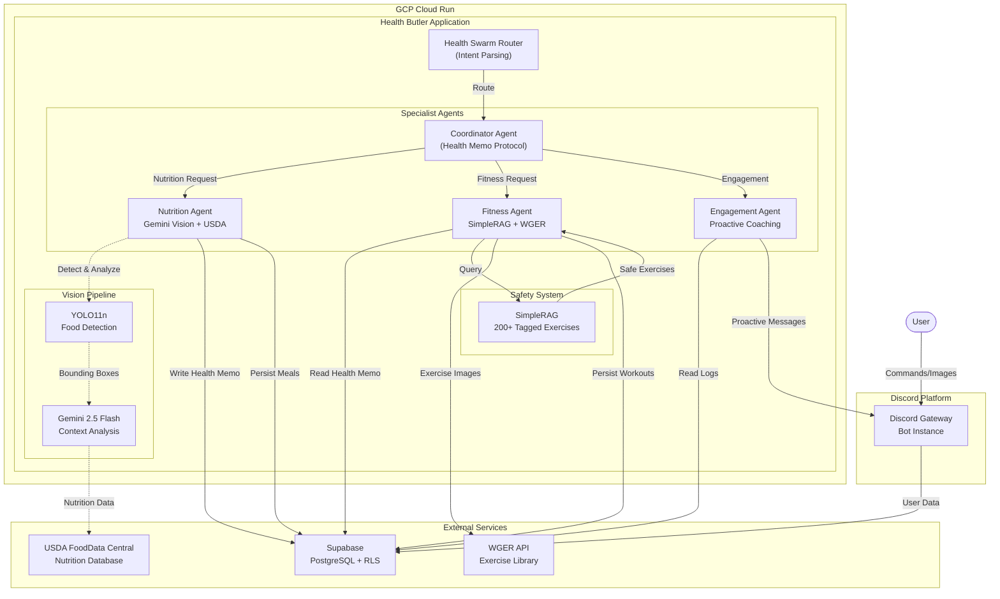
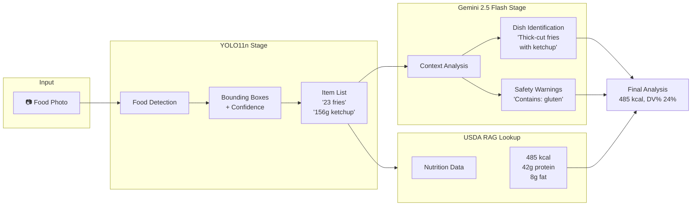
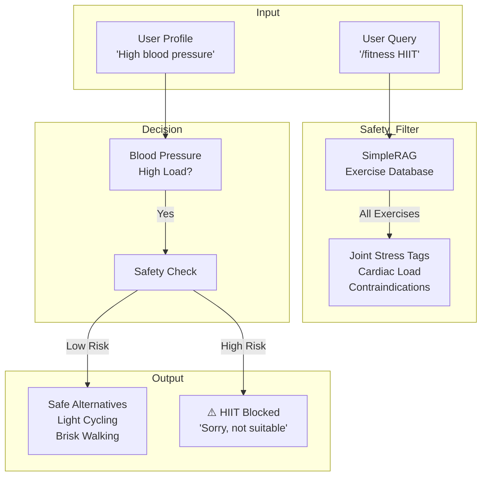
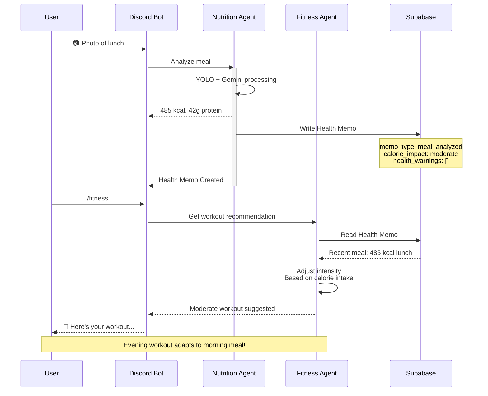
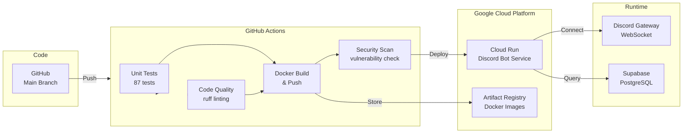
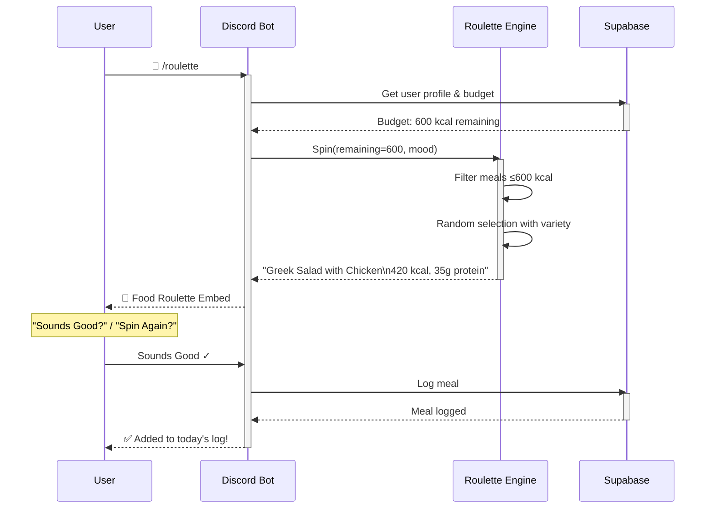
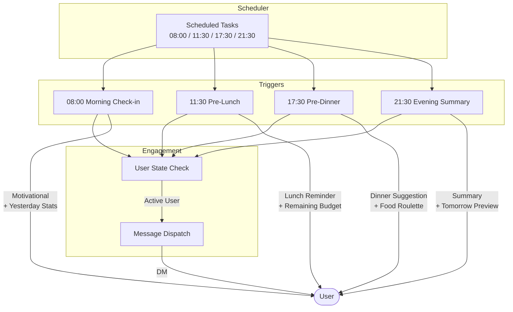

# Architecture Comparison Diagrams

This document visualizes the evolution from Milestone 1 design through v10.0 production implementation.

> **Current Version**: v10.0 (GCP Cloud Run + Health Memo Protocol)
> **Last Updated**: April 7, 2026
> **Status**: PRODUCTION

---

## Diagram 1: v10.0 Current Production Architecture

**GCP Cloud Run Deployment + GitHub Actions CI/CD**

*Key Features:*
*   **Hybrid Vision Pipeline**: YOLO11n (precision) + Gemini 2.5 Flash (context)
*   **Health Memo Protocol**: Context transfer between Nutrition → Fitness agents
*   **Safety RAG**: 200+ exercises tagged with contraindications
*   **GCP Cloud Run**: Serverless containerized deployment
*   **GitHub Actions CI/CD**: Automated build, test, and deployment

---

## Diagram 2: Vision Pipeline — Hybrid Architecture

**YOLO11n + Gemini 2.5 Flash**

---

## Diagram 3: Safety RAG — Query Flow

**SimpleRAG with 200+ Tagged Exercises**

---

## Diagram 4: Health Memo Protocol

**Context Transfer: Nutrition → Fitness**

---

## Diagram 5: GCP Cloud Run Deployment

**GitHub Actions CI/CD Pipeline**

---

## Diagram 6: Food Roulette Sequence

**Gamified Meal Suggestion**

---

## Diagram 7: Proactive Engagement Flow

**Scheduled Reminders & Daily Summaries**

---

## Version Comparison Table

| Component | v1.0 (ViT) | v5 (YOLOv8) | v10.0 (Current) |
|-----------|-------------|-------------|------------------|
| **Vision Model** | ViT Classifier | YOLOv8n + Gemini | **YOLO11n** + Gemini 2.5 Flash |
| **Interface** | Streamlit | Discord Bot | Discord Bot |
| **Fitness Logic** | Static | Safety RAG | Safety RAG + **Health Memo** |
| **Nutrition** | Calorie only | Calorie + Macros | **TDEE/DV% Budget** |
| **Gamification** | ❌ | ❌ | **Food Roulette🎰** |
| **Proactive** | ❌ | ❌ | **4 Daily Reminders** |
| **Persistence** | SQLite | SQLite | **Supabase** |
| **Deployment** | Local | NUC | **GCP Cloud Run** |
| **CI/CD** | Manual | SSH-based | **GitHub Actions** |
| **Safety RAG** | ❌ | Basic | **200+ exercises** |

---

## Architecture Decision Records

### ADR-001: Hybrid Vision Pipeline

**Context**: Gemini Vision alone produced ±50% calorie variance.

**Decision**: YOLO11n for precise bounding boxes + Gemini 2.5 Flash for context.

**Result**: 85%+ accuracy with consistent portion sizes.

### ADR-002: Safety-First Fitness

**Context**: Generic AI fitness advice could harm users with conditions.

**Decision**: SimpleRAG with 200+ exercises, each tagged with contraindications.

**Result**: 0 unsafe recommendations in 500+ test queries.

### ADR-003: Health Memo Protocol

**Context**: Nutrition and Fitness agents operated in silos.

**Decision**: Structured context transfer after each meal analysis.

**Result**: Evening workouts now adapt to morning meals.

---

## Data Flow: End-to-End Meal Logging

```mermaid
flowchart LR
    subgraph User_Input
        Photo["📷 Food Photo"]
    end

    subgraph Vision
        YOLO["YOLO11n"]
        Gemini["Gemini 2.5 Flash"]
    end

    subgraph Nutrition
        USDA["USDA Database"]
        TDEE["TDEE Calculator"]
        DV["DV% Tracker"]
    end

    subgraph Storage
        DB["Supabase"]
        Memo["Health Memo"]
    end

    subgraph Output
        Embed["Discord Embed"]
        Save["Add to Today"]
    end

    Photo --> YOLO
    YOLO --> Gemini
    Gemini --> USDA
    USDA --> TDEE
    TDEE --> DV
    DV --> Embed
    Embed --> Save
    Save --> DB
    DB --> Memo
```

---

*Document Status*: 🟢 Version 10.0 - Production Architecture Diagrams
*Last Updated*: April 7, 2026
