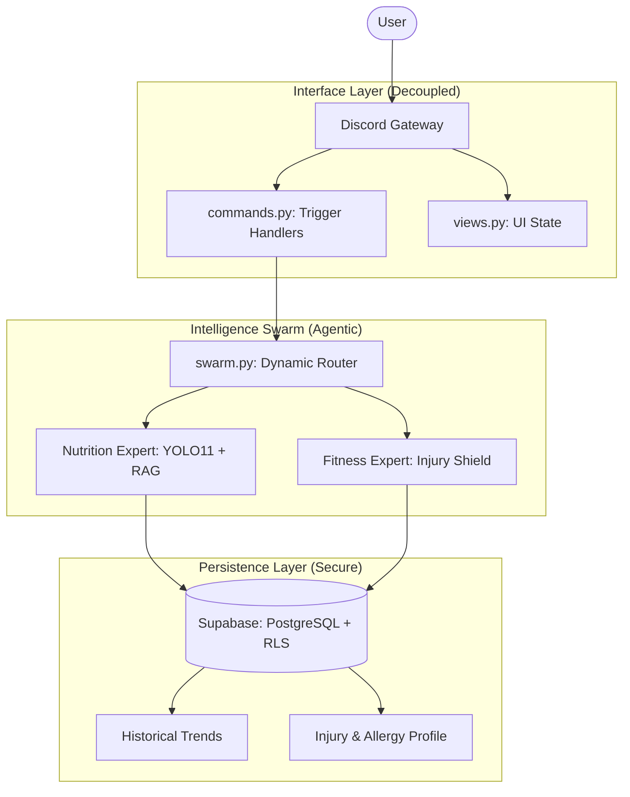

# Milestone 2 Report: Evolution to Agentic Swarm (v2.0)
**Date:** 2026-03-01
**Status:** Core Pipeline Operational ✅

## 1. Executive Summary: The v1.0 to v2.0 Leap
Since Milestone 1, the **Personal Health Butler AI** has evolved from a simple Streamlit/ViT prototype into a **decoupled, multi-agent production system** hosted on Discord. We have successfully solved the "God Object" bottleneck, implemented safe per-user persistence, and upgraded our vision perception to state-of-the-art YOLO11.

## 2. Key Functional & Technical Upgrades

### A. Perception: State-of-the-Art Vision (v2.0)
- **Model Upgrade (Module 7)**: Transitioned to **YOLO11** (n/s) for food localization, maintaining `<2s` latency.
- **Risk Perception (Module 2)**: The `GeminiVisionEngine` now identifies **Cooking Methods** (Fried, High-Oil, Processed) and assigns a **Health Score (1-10)** to flag nutritional risks.

### B. The "Smart Swarm" & Safety Protocol
- **Health Memo Protocol (Module 3)**: Implemented a cross-agent handoff where the **Nutrition Agent** passes meta-data (`HealthMemo`) to the **Fitness Agent**.
- **Dynamic Safety Filtering (Module 3 Part 2)**: Introduced **BR-001 Safety Shield**. If fried/processed food is detected, the Fitness Agent automatically blocks high-intensity activities (e.g., HIIT, Sprinting) and advises lower-intensity alternatives.

### C. Premium UI & Proactive Care
- **Rich Media (Module 5)**: Integrated **wger.de API** with a hybrid local cache (800+ entries) to display real exercise images for all suggestions.
- **Proactive Engagement (Module 6 & 9)**: 
    - **Morning Check-ins**: Automated status reports on goals.
    - **Food Roulette🎰**: A budget-aware meal suggestion system with weighted physics-based animation (Module 14).
    - **Pre-meal Budgets**: Real-time calorie/macro remaining calculating using the **Mifflin-St Jeor** formula (Module 8).

## 3. Core Architectural Moats

### A. Professional Decoupling (Module 10-12)
- **God Object Elimination**: Reduced `bot.py` by **47%** by migrating logic to `views.py`, `commands.py`, and `profile_utils.py`.
- **Intent-Based Orchestration**: Introduced a sophisticated `intent_parser.py` that handles complex natural language triggers for summaries and profile management.

### B. Privacy-First Identity (Module 13)
- **Sensitive Intent Rerouting**: Automated redirection of PII-sensitive queries (Summary, Trends) from public Discord text channels to private DMs.

## 4. Engineering Pivots & Challenges
- **Latency Balancing**: Switched to parallel execution for YOLO/Gemini to meet the **<5s total response** KPI.
- **Persistence Evolution**: Moved from simple SQL queries to a robust **Supabase + RLS (Row Level Security)** model to ensure data isolation between users.
- **Ephemeral Storage Compliance (Module 4)**: Implemented strict `finally` block cleanup for all vision tasks (BR-005).

## 4. Architecture Diagram (v2.0 Decoupled)

## 5. Challenges & Engineering Pivots
- **Latency vs. Accuracy**: We implemented **Parallel perception** (YOLO and Gemini running concurrently) to keep response times under 5 seconds.
- **God Object Debt**: The modular refactor was critical to allow multiple teammates to work on different agents without merge conflicts.
- **Privacy Barrier**: Realized health data in public channels was a friction point; implemented the **"Sensitive Intent" redirector** to DMs.

## 6. Project Outlook (Target v3.0)
- **API Synergy**: Integration with Wger and Google Health Connect.
- **Visual Memory**: AI-driven "Before & After" meal comparison.
- **Behavioral Psychology**: Adaptive personality based on user consistency.
