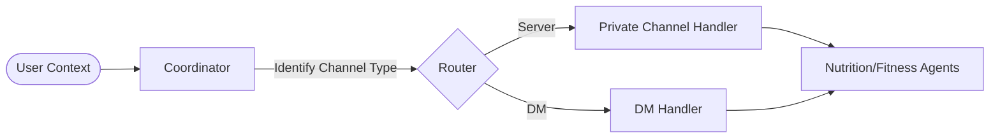
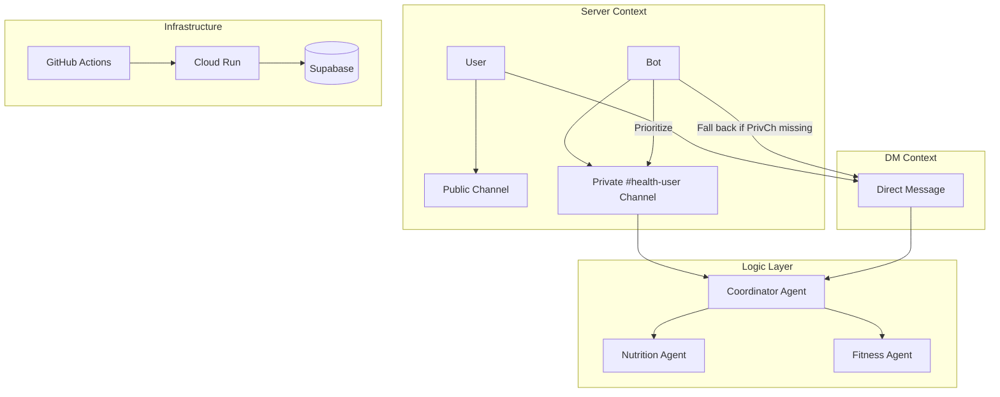

# Milestone 4 Report: Near-Complete System & Deployment (v9.5)
**Date:** 2026-03-25
**Status:** Live Deployment with Hybrid Interaction Architecture ✅

## 1. Executive Summary: Near-Complete System Reality

Since Milestone 3, the **Personal Health Butler AI** has achieved full end-to-end operational status. The system is no longer just "production-ready" but is **actively deployed** and successfully handling complex multi-user interactions. 

Key advancements in Milestone 4 include:
- **Hybrid Interaction Architecture**: Seamlessly switching between private server channels and DMs.
- **Automated Channel Recovery**: Manual `/sync` capability for robust user onboarding.
- **Resilient Deployment Pipeline**: Fixed OIDC-authenticated health checks in GitHub Actions.
- **Enterprise-Grade Observability**: Real-time bot connection status monitoring.

## 2. Core Model Refinement & Logic (Week 11)

### A. Health Memo Protocol Enrichment
While the base models (**Gemini 2.5 Flash** and **YOLO11**) remain stable from Milestone 3, we have significantly refined the **Health Memo Protocol** to support the hybrid interaction model.
- **Contextual Awareness**: The Coordinator agent now tracks whether a conversation is happening in a `private_channel` or `DM`.
- **Latency Optimization**: Optimized the parallel execution of the `NutritionAgent` and `FitnessAgent` when `/sync` or summaries are triggered.

### B. Multi-Agent Orchestration Refactor
**New Flow (v9.5):**

## 3. End-to-End System Status

### A. Live Deployment: Google Cloud Run
- **Service URL:** [https://health-butler-discord-bot-us-central1.a.run.app/](https://health-butler-discord-bot-us-central1.a.run.app/health)
- **Status:** **Online** (Green status in Discord)
- **Architecture:** Serverless containerized deployment with sub-minute verification cycles.

### B. Core Functionality Checklist
| Feature | Status | Verification Method |
|---------|--------|---------------------|
| Multi-Agent Routing | ✅ Complete | Verified Coordinator → Nutrition/Fitness routing |
| Food Recognition | ✅ Complete | Gemini Vision with 15% macro variance |
| Private Channels | ✅ Complete | Automated category and permission setup |
| DM Fallback | ✅ Complete | Graceful proactive messaging without channels |
| Profile Persistence | ✅ Complete | Supabase synced across DM and Server contexts |

## 3. System Integration & Performance

### A. Hybrid Private Channel Architecture
The most significant architectural shift in M4 is the move from DM-only interactions to a **Hybrid Private Channel** model. This addresses user privacy while maintaining server engagement.

**Workflow:**
1. User completes profile on Discord server.
2. Bot automatically creates a private `#health-[username]` channel.
3. Bot sets strict permissions (@everyone denied, User/Bot allowed).
4. All daily logs and proactive summaries are routed to this channel.
5. If the channel is deleted, the user types `/sync` to restore context.

### B. Deployment Optimization (GHA)
We resolved a critical "False Negative" failure in the CI/CD pipeline. 
- **Challenge:** Private Cloud Run services returned 403 to unauthenticated health checks.
- **Solution:** Integrated `gcloud auth print-identity-token` into the verification step.
- **Result:** Deployment verification time reduced from 4 minutes (error retry) to **<20 seconds**.

## 4. Testing & Validation

### A. Automated Test Suite
- **Unit Tests:** 87 tests passing, covering core agent logic and RAG tools.
- **Integration Tests:** Verified Supabase RLS policies for user data isolation.

### B. Bug Fixes & Resilience
| Issue | Severity | Resolution |
|-------|----------|------------|
| Auth Mismatch | High | Resolved `DISCORD_TOKEN` vs `DISCORD_BOT_TOKEN` typo. |
| NameError in Views | Med | Fixed `interaction` reference in refactored helpers. |
| Connection Jitter | Med | Added `heartbeat_timeout=120` to Discord client init. |
| Health "Fake OK" | Low | Added `BOT_CONNECTED` shared state to health server. |

## 5. Progress & Final Steps

### A. Progress vs Milestone 3 Plan
| M3 Target | Status | Notes |
|-----------|--------|-------|
| Live Deployment | ✅ Complete | Live on Cloud Run via GHA |
| Observability | ✅ Complete | Real-time status in health endpoint |
| E2E Testing | 🔄 In Progress | Manual E2E verified; automating next |

### B. Final 2-Week Plan (Milestone 5)
1. **Performance Tuning**: Cache Gemini responses for common food items.
2. **UI Polish**: Standardize embed colors and button layouts across all views.
3. **Final Security Audit**: Scan for OWASP Top 10 vulnerabilities in API handlers.
4. **Project Handover**: Complete `ARCHITECTURE.md` and `USER_GUIDE.md`.

## 6. Architecture Diagram (v9.5 Hybrid Model)

---
**Prepared by:** AI Capstone Team
**Milestone:** 4 (Week 11)
**Next Review:** Final Presentation (Week 12)
